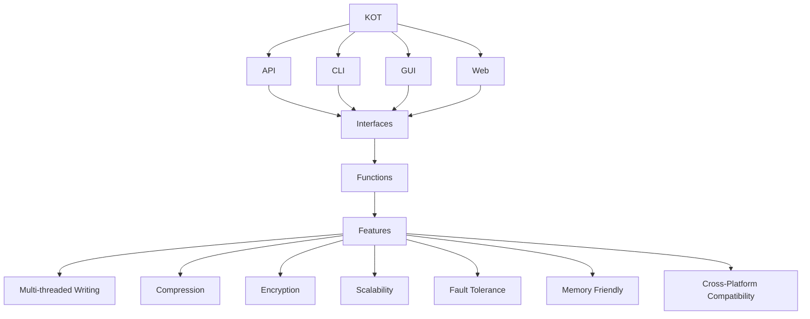

# KOT

The KOT is a Flexible, secure and scalable database and your python scripts. It comes with built-in features for compressing and encrypting data, and is compatible with all operating systems. With easy-to-use commands, the KOT is full-fit for configuration and small object storing proccess.

[Website](https://kotdatabase.dev/) | [Twitter](https://twitter.com/kot)


## Installation
You can install KOT by pip3:

```console
pip3 install kot
```


# Using

```python
from kot import KOT

# Creating databases
db = KOT("My_New_DB")


# Flexible
db.set("Key", "String")
db.set("Key", 123)
db.set("Key", 123.213)
db.set("Key", Object())
db.set("Key", ["Alist"])
db.set("Key", {"a": "dict"})
db.set("Key", (1,"Atuple"))
db.set("Key", file="onur.jpg")
db.set("Key", file="onur.anytype")


# Secure
db.set("Key", "String",        encryption_key="my_encryption_key")
db.set("Key", 123,             encryption_key="my_encryption_key")
db.set("Key", 123.213,         encryption_key="my_encryption_key")
db.set("Key", Object(),        encryption_key="my_encryption_key")
db.set("Key", ["Alist"],       encryption_key="my_encryption_key")
db.set("Key", {"a": "dict"},   encryption_key="my_encryption_key")
db.set("Key", (1,"Atuple"),    encryption_key="my_encryption_key")
db.set("Key", file="onur.jpg", encryption_key="my_encryption_key")


# Scalable
db.get("Key") #Instant, no waiting and no searching


```

## Interfaces
- [CLI](https://KOT.github.io/KOT/interfaces/cli.html)
- [GUI](https://KOT.github.io/KOT/interfaces/gui.html)
- [WEB](https://KOT.github.io/KOT/interfaces/web.html)
- [API](https://KOT.github.io/KOT/interfaces/api.html)


## Features

- **Flexibility**: Save data in any format, including objects and files, providing great flexibility and adaptability to different use cases and data structures.
- **Compressing**: Compress data to minimize storage space while enabling faster data retrieval and processing.
- **Encryption**: Keep sensitive information secure and private with the included encryption feature.
- **Scalability**: Offers stable processing times of set, get, and delete commands, regardless of the dataset's size.
- **Fault Tolerance**: By the design of the KOT, it is fully fault-tolerant because each datas are designed to be independent of each other on the disk.
- **Memory Friendly**: The KOT is designed to use as little memory as possible. It only loads the data you want to access into memory.
- **Cross-Platform Compatibility**: Compatible with all operating systems, making it easier to integrate into any project.
- **Docker Avaibility**: You can use KOT API as an container on Docker platform. It's good for more stable, safe and durable uses.
- **Transactional and Asynchronous Operations**: Perform multiple operations in a single transaction or perform operations asynchronously for improved performance.





## Contributing
Contributions to KOT are welcome! If you have any suggestions or find a bug, please open an issue on the GitHub repository. If you want to contribute code, please fork the repository and create a pull request.

## License
KOT is released under the MIT License.

<h2 align="center">
    Contributors
</h2>
<p align="center">
    Thank you for your contribution!
</p>
<p align="center">
    <a href="https://github.com/KOT/KOT/graphs/contributors">
      
    </a>
</p>
<p align="center">
    and <a href="https://sweep.dev/">Sweep !</a>
</p>
