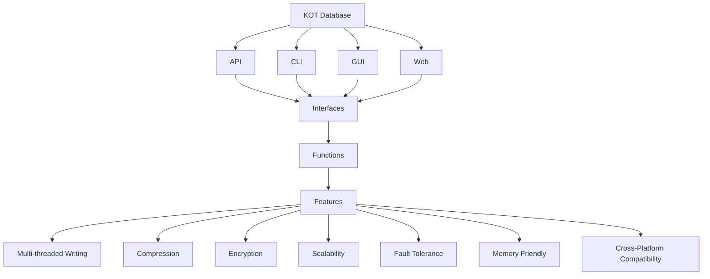

# KOT database | [](https://github.com/onuratakan/KOT/actions/workflows/tests.yml) | [](https://codecov.io/gh/onuratakan/KOT)

The KOT database is a flexible, secure and scalable database that supports multiple data formats. It comes with built-in features for compressing and encrypting data, and is compatible with all operating systems. With easy-to-use commands, the KOT database is an excellent choice for developers seeking an efficient and reliable storage solution for their data.

## Features

- **Flexibility**: Save data in any format, including objects and files, providing great flexibility and adaptability to different use cases and data structures.
- **Compressing**: Compress data to minimize storage space while enabling faster data retrieval and processing.
- **Encryption**: Keep sensitive information secure and private with the included encryption feature.
- **Scalability**: Offers stable processing times of set, get, and delete commands, regardless of the dataset's size.
- **Fault Tolerance**: By the design of the KOT database, it is fully fault-tolerant because each datas are designed to be independent of each other on the disk.
- **Memory Friendly**: The KOT database is designed to use as little memory as possible. It only loads the data you want to access into memory.
- **Cross-Platform Compatibility**: Compatible with all operating systems, making it easier to integrate into any project.
- **Docker Avaibility**: You can use KOT database API as an container on Docker platform. It's good for more stable, safe and durable uses.
- **Transactional and Asynchronous Operations**: Perform multiple operations in a single transaction or perform operations asynchronously for improved performance.




## Installation
You can install KOT by pip3:

```console
pip3 install kot
```

## Usage
KOT is aimed to be used in Python and command line as well. You can use it in your Python code or in command line.


### In Python

```python
from kot import KOT

# Creating databases
client_address_db = KOT("client_addresses")


# Setting functions
client_address_db.set("Onur", "Sivas")
#client_address_db.set("Onur", "Sivas", compress=True)
#client_address_db.set("Onur", "Sivas", encryption_key="my_encryption_key"))


# Getting functions
print(my_kot.get("Onur"))

my_kot.delete("Onur")
```

### Console

```console	
KOT --name=client_addresses set Onur Sivas
```
```console
KOT --name=client_addresses get Onur
```

## Documentation
You can find the documentation [here](https://onuratakan.github.io/KOT/).


## Contributing
Contributions to KOT are welcome! If you have any suggestions or find a bug, please open an issue on the GitHub repository. If you want to contribute code, please fork the repository and create a pull request.

## License
KOT is released under the MIT License.
